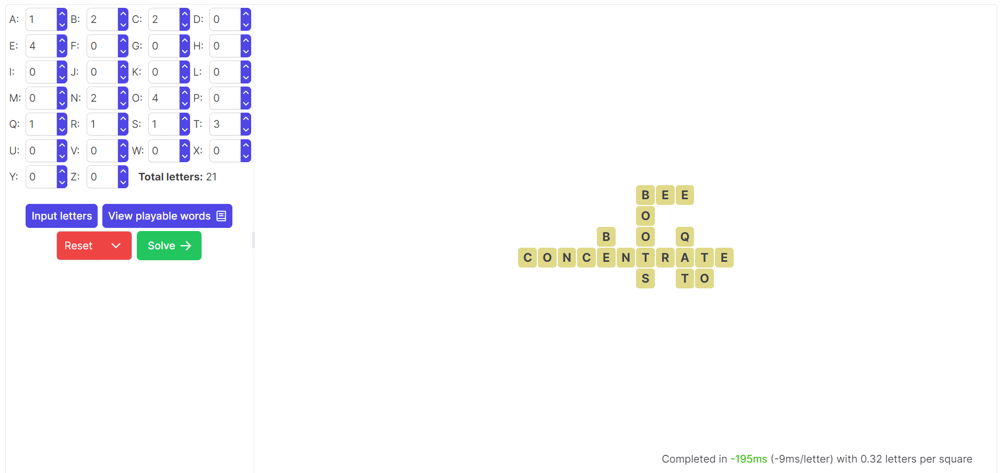

# Bananagrams solver

This is a pure-browser [Bananagrams](https://bananagrams.com/) solving program (not affiliated in any way with the official Bananagrams), complete with GUI; it is based off the Rust implementation [here](https://github.com/williamdwatson/bananagrams_solver).

The underlying algorithm has a few heuristics - it favors longer words and boards that alternate horizontally-vertically - but ultimately is exhaustive (if there is a solution, it will be found). It is relatively fast for smaller hands, but substantially slower for larger ones. 

*Example solution of a board - note that there is a bug with the time taken*

## Usage
A GitHub Pages-hosted version can be found at [here] (https://williamdwatson.github.io/bananagrams_solver_web/) and runs purely in the browser.

### Development
Download the code, navigate to the directory, and run `npm install`. Then launch the development version with `npm run dev`.

## Code Layout
The `src` folder holds the code, written in Typescript/React. `App.tsx` is the parent of the frontend components (technically `main.tsx` is the parent, but it is essentially a wrapper); the components include `letter_input.tsx` for inputing which letters are in the hand and `results_display.tsx` which dislays the results as a table. The actual solver code is within `solver.ts`.

### Sources
* `short_dictionary.txt` was derived from [MIT's 10000 word list](https://www.mit.edu/~ecprice/wordlist.10000), as well as [one derived from Google](https://github.com/first20hours/google-10000-english/blob/d0736d492489198e4f9d650c7ab4143bc14c1e9e/20k.txt).
* `dictionary.txt` was taken from [here](https://github.com/redbo/scrabble/blob/05748fb060b6e20480424b9113c1610066daca3c/dictionary.txt).

## How It Works
The hand of letters is represented by a `Uint8Array` (the number of each letter present in the hand), while the board is represented as a 144x144 grid of numbers (flattend to a single `Uint8Array`); words are represented as `Uint8Array`s as well (with each number being 0-25, or the "empty value" 30). When play begins, a vector of all possible words playable with the current hand of letters is generated.

During play, we keep track of the boundary of the board (i.e. the square in which all played letters fall). Play then occurs recurively. The play function loops through trying every possible word at every position within the board boundary (and outside ± the length of that word). Every time a word is tried in a location, the validity of that placement is checked (i.e. are all letters connected, are all words valid, and have we not used too many of any letter). If valid, the function is recursively called; if not, the loop continues (and if the loop finishes, we backtrack up one recursive level). Words are tried both horizontally and vertically, althought the order in which they are tried alternates as a heuristic (since it's easier to play a vertical word onto a horizontal word than play two horizontal words side-by-side). Because this check is ultimately exhaustive, it can take quite some time to determine that there are no valid solutions. Unlike the Rust version, this version is not inherently multithreaded or even compiled - that depends on the browser. However, a WebWorker is used to prevent the frontend from freezing during solving.

A heuristic is used when only a single additional letter is added to the previously recorded hand: that letter is tried at every spot on the board. If that fails, the recursive processing begins anew.

## Future enhancements
More clever strategies should be able to reduce the processing time, as could heuristics to optionally remove the exhausive nature of the alogrithm. In addition, when playing off an existing board, removing individual words and then reprocessing with the slightly reduced board could greatly increase overlap between the previous solution and the new solution (as it stands, if one letter is added but can't fit anywhere in the board, an entirely different solution might be produced).