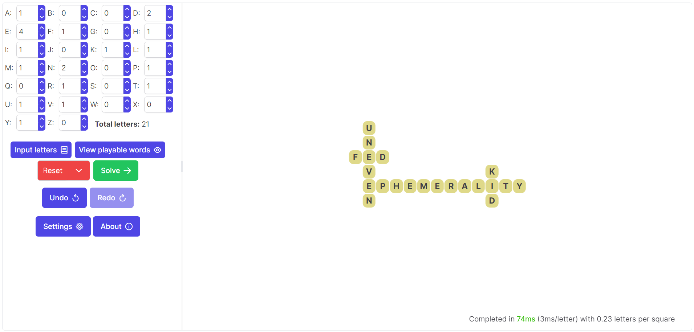

# Bananagrams solver

This is a purely in-browser [Bananagrams](https://bananagrams.com/) solving program (not affiliated in any way with the official Bananagrams), complete with GUI; it is based off the Rust implementation [here](https://github.com/williamdwatson/bananagrams_solver) slightly modified then compiled into WebAssembly using [wasm-pack](https://github.com/rustwasm/wasm-pack).

The underlying algorithm has a few heuristics - it favors longer words and boards that alternate horizontally-vertically, but with the proper settings will ultimately be exhaustive. Note that this solver is generally slower than the Rust version - for instance, solving a hand with all 144 letters around 35 seconds on my machine.

*Example solution of a board*

## Usage
A GitHub Pages-hosted version can be found [here](https://williamdwatson.github.io/bananagrams_solver_web/) and runs purely in the browser.

### Development
Download the code, navigate to the directory, and run `npm install`. Then launch the development version with `npm run dev`. If updating the Rust code, navigate to the `bg-solver` directory and run `wasm-pack build --target web`.

### Code Layout
The `src` folder holds the code, written in Typescript/React. While `main.tsx` is the entrypoint, `App.tsx` is the parent of the frontend components.

The solver WASM code is called from `solver.ts`, running as a web worker. The Rust code that compiles into WASM is present in the `bg-solver` directory, primarily under `src/lib.rs`.

### Sources
See https://github.com/williamdwatson/bananagrams_solver?tab=readme-ov-file#sources

## How It Works
The solver works in the same manner as described in the [Rust version](https://github.com/williamdwatson/bananagrams_solver), with the primary difference being that threading is not used (as it is currently unsupported by WebAssembly) - this generally makes the solver slower. Other changes include state management being performed in JavaScript, a new mobile-friendly display, and since terminating a web worker is easy, the solver can be cancelled.